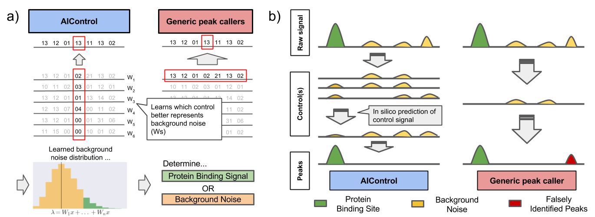

# AIControl

AIControl removes need of performing Input/control exeperiments for ChIP-seq assays by imputing them from public data.

*Figure 1: (a) Comparison of AIControl to other peak calling algorithms. (left) AIControl
learns appropriate combinations of publicly available control ChIP-seq datasets to impute background
noise distributions at a fine scale. (right) Other peak calling algorithms use only one
control dataset, so they must use a broader region (typically within 5,000-10,000 bps) to estimate
background distributions. (bottom) The learned fine scale Poisson (background) distributions are
then used to identify binding activities across the genome. (b) An overview of the AIControl
approach. A single control dataset may not capture all sources of background noise. AIControl
more rigorously removes background ChIP-seq noise by using a large number of publicly available
control ChIP-seq datasets*

## Required libraries for AIControl

AIControl module is coded in **Julia 0.6.4**.

Before you start, make sure your have the following required modules.
Use `Pkg.add()` to install libraries.
- Pkg.add("DataFrames")
- Pkg.add("JLD")
- Pkg.add("Distributions")
- Pkg.add("CSV")

## Required data files
AIControl uses mass amount of public Input ChIP-seq data and some precomputed data files. We have done our best to compress them so that you only need to download about 7GB (obviously dependent on how many control files you want to use), and up to 15GB of free disk space to extract them. All files are shared through Google Drive. **These files need to be opened to the "./data" folder.**

### For 440 ENCODE controls with duplicate reads
Using these files will recreate the main results of the paper. 
- `forward.data100.dup.tar.bz2` (2.3GB):   
compressed binned (100bps) signals of forward reads for all 440 Input signals.
- `reverse.data100.dup.tar.bz2` (2.3GB):  
compressed binned (100bps) signals of reverse reads for all 440 Input signals.

When you extracted, all files together requires XGB. 

### For 274 ENCODE controls with duplicate reads
We also have a subsampled version, which is validated to have comperable performance. 
- `forward.data100.reduced.dup.tar.bz2` (2.3GB):   
compressed binned (100bps) signals of forward reads for all 440 Input signals.
- `reverse.data100.reduced.dup.tar.bz2` (2.3GB):  
compressed binned (100bps) signals of reverse reads for all 440 Input signals.

When you extracted, all files together requires XGB. 

If you really want to reduce the data size, we have a version where we remove duplicate reads.

## Paper
We have a paper in BioRxiv evaluating and comparing the performance of AIControl to other peak callers in various metrics and settings. **AIControl:  Replacing matched control experiments with machine learning improves ChIP-seq peak identification** ([BioRxiv](https://www.biorxiv.org/content/early/2018/03/08/278762?rss=1))

## How to use

**1. Map your FASTQ file from ChIP-seq to the `hg38` assembly from the UCSC database.**  
   We have validated our pipeline with `bowtie2`. You can download the genome assembly data from [here](http://hgdownload.soe.ucsc.edu/goldenPath/hg38/bigZips/hg38.fa.gz). They are also available through our Google Drive.
   *Example command:*  
   `bowtie2 -x hg38 -q -p 10 -U example.fastq -S example.sam`  
   
**2. Convert the resulting sam file into a bam format.**  
*Example command:*  
`samtools view -Sb example.sam > example.bam`  
   
**3. Sort the bam file in lexicographical order.**  
   If you go through step 1 with the UCSC hg38 assembly, sorting with `samtools sort` will do its job.  
   *Example command:*  
   `samtools sort -o example.bam.sorted example.bam`  
   
   Sometimes your bam file is mapped to hg38, but to a slightly differet version or different ordering of chromosomes (a.k.a. non-lexicographic). For example, if you download a bam file directly from ENCODE portal, it is mapped to a slightly different version of hg38. A recommended way of avoiding this problem is to extract a fastq file from your bam file, go back to step 1, and remap it with bowtie2 using the UCSC hg38 assembly. `bedtools` provide a way to generate a fastq file from your bam file.
   *Example command:*  
   `bedtools bamtofastq  -i example.bam -fq example.fastq`  
   
**4. Download data files and locate them in the right places.**  
As stated above, AIControl requires you to download precomputed data files. Please download and extract them to "./data" folder.  

**5. Run AIControl as julia script.**  
Simply do `julia aicontrol.jl [example.bam.sorted] [output_prefix]`.  
Currently we accept two flags. 
- `-reduced`: indicates that you are using the subsampled version of control files.
- `-nodup`: indicates that you are running without duplicate reads.

## Simple trouble shooting
- You are using Julia 0.6 and above.
- You downloaded necessary files for `-reduced` or `-nodup` if you are running with those flags.
- You sorted the input bam files according to the UCSC hg38 assembly.  

If you have questions, please e-mail to hiranumn at cs dot washington do edu.

